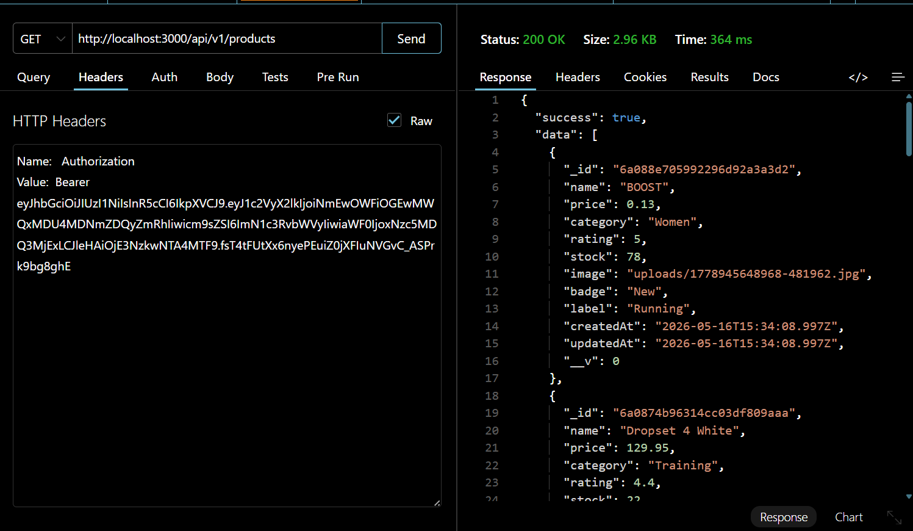
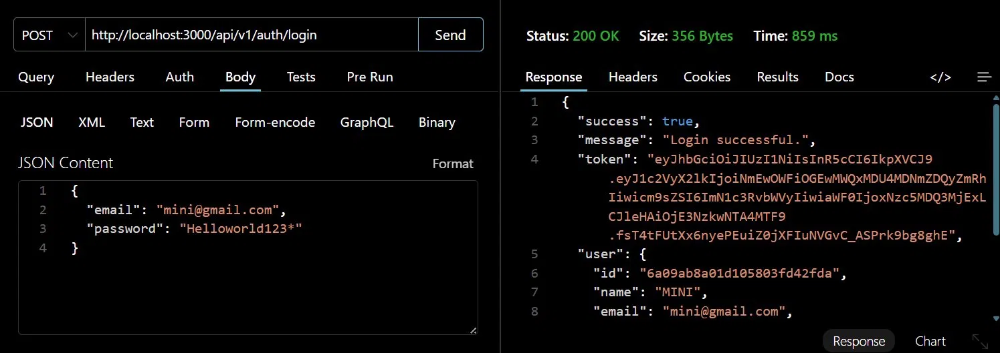
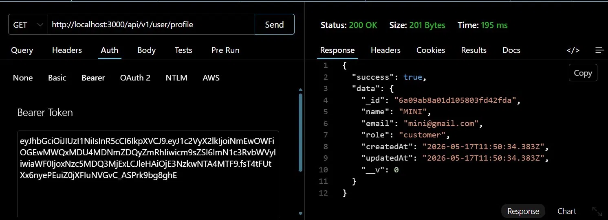
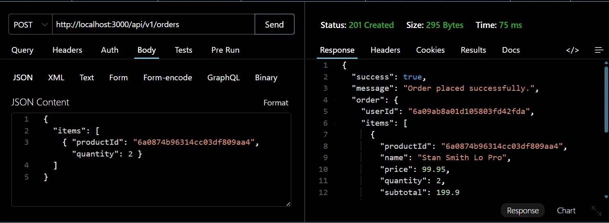

# Lab Assignment 4 – RESTful API with JWT Authentication
### SP24-BCS-066 | Web Technologies

---

## Overview

This assignment extends the Adidas e-commerce application built in previous labs by shifting it toward a **headless architecture**. A fully functional RESTful API has been added under the `/api/v1` prefix, allowing external clients (mobile apps, React frontends, etc.) to interact with the database securely using **JSON Web Tokens (JWT)** for stateless authentication.

The existing EJS-based website, admin panel, and session-based authentication from previous labs remain completely intact and unchanged.

---

## How to Run

### 1. Install the new dependency
```bash
npm install jsonwebtoken
```

### 2. Update your `.env` file
Make sure your `.env` file contains the new `JWT_SECRET`:
```
MONGO_URI=mongodb://127.0.0.1:27017/adidas
PORT=3000
ADMIN_SECRET=adidas@admin123
SESSION_SECRET=adidas-super-secret-session-key-change-me
JWT_SECRET=adidas-jwt-super-secret-key-change-in-production-2024
```

### 3. Start the server
```bash
npm run dev
```

---

## Project File Structure

```
LAB3-WEB/
├── .env                          
├── app.js                        
├── package.json                  
│
├── middleware/
│   ├── isadmin                   
│   ├── Isloggedin                
│   └── verifyToken.js            
│
├── models/
│   ├── User.js                   
│   └── product.js                
│
├── routes/
│   ├── admin.js                 
│   ├── auth.js                   
│   ├── products.js               
│   └── api.js                    
│
├── views/                        
├── public/                       
├── seed/                         
└── screenshots/                  
```

---

## API Endpoints

Base URL: `http://localhost:3000/api/v1`

### Public Endpoints (No Token Required)

| Method | Endpoint | Description |
|---|---|---|
| `GET` | `/api/v1/products` | Get all products (paginated + filtered) |
| `GET` | `/api/v1/products/:id` | Get a single product by ID |
| `POST` | `/api/v1/auth/login` | Login and receive a JWT token |

### Protected Endpoints (JWT Required)

| Method | Endpoint | Description |
|---|---|---|
| `GET` | `/api/v1/user/profile` | Get the authenticated user's profile |
| `POST` | `/api/v1/orders` | Place an order |

---

## Detailed Endpoint Documentation

### 1. GET /api/v1/products
Returns a paginated list of all products with optional filtering.

**Query Parameters (all optional):**
| Parameter | Type | Description |
|---|---|---|
| `page` | number | Page number (default: 1) |
| `limit` | number | Items per page (default: 10, max: 50) |
| `category` | string | Filter by category (e.g. Running, Football) |
| `search` | string | Search by product name |
| `minPrice` | number | Minimum price filter |
| `maxPrice` | number | Maximum price filter |
| `sortBy` | string | Sort field: price, name, rating, createdAt |
| `order` | string | asc or desc (default: desc) |

**Example Request:**
```
GET /api/v1/products?category=Running&page=1&limit=5
```

**Example Response:**
```json
{
  "success": true,
  "data": [ ... ],
  "pagination": {
    "total": 34,
    "totalPages": 4,
    "currentPage": 1,
    "limit": 10,
    "hasNextPage": true,
    "hasPrevPage": false
  }
}
```

---

### 2. GET /api/v1/products/:id
Returns a single product by its MongoDB `_id`.

**Example Request:**
```
GET /api/v1/products/6a0874b96314cc03df809aa4
```

**Example Response:**
```json
{
  "success": true,
  "data": {
    "_id": "6a0874b96314cc03df809aa4",
    "name": "Stan Smith Lo Pro",
    "price": 99.95,
    "category": "Originals",
    "rating": 4.6,
    "stock": 80
  }
}
```

---

### 3. POST /api/v1/auth/login
Authenticates a user and returns a signed JWT token.

**Request Body:**
```json
{
  "email": "user@example.com",
  "password": "YourPassword1!"
}
```

**Example Response:**
```json
{
  "success": true,
  "message": "Login successful.",
  "token": "eyJhbGciOiJIUzI1NiIsInR5cCI6IkpXVCJ9...",
  "user": {
    "id": "6a09ab8a01d105803fd42fda",
    "name": "MINI",
    "email": "mini@gmail.com",
    "role": "customer"
  }
}
```

> The token must be included in all protected requests as:
> `Authorization: Bearer <token>`

---

### 4. GET /api/v1/user/profile ⛔ Protected
Returns the authenticated user's profile data (password excluded).

**Headers Required:**
```
Authorization: Bearer <your_token_here>
```

**Example Response:**
```json
{
  "success": true,
  "data": {
    "_id": "6a09ab8a01d105803fd42fda",
    "name": "MINI",
    "email": "mini@gmail.com",
    "role": "customer",
    "createdAt": "2026-05-17T11:50:34.383Z"
  }
}
```

---

### 5. POST /api/v1/orders ⛔ Protected
Places an order for the authenticated user.

**Headers Required:**
```
Authorization: Bearer <your_token_here>
```

**Request Body:**
```json
{
  "items": [
    { "productId": "6a0874b96314cc03df809aa4", "quantity": 2 }
  ]
}
```

**Example Response:**
```json
{
  "success": true,
  "message": "Order placed successfully.",
  "order": {
    "userId": "6a09ab8a01d105803fd42fda",
    "items": [
      {
        "name": "Stan Smith Lo Pro",
        "price": 99.95,
        "quantity": 2,
        "subtotal": 199.9
      }
    ],
    "total": 199.9,
    "status": "pending",
    "createdAt": "2026-05-18T..."
  }
}
```

---

## JWT Implementation

### How It Works
```
1. User sends email + password to POST /api/v1/auth/login
2. Server verifies credentials against MongoDB
3. Server signs a JWT with { user_id, role } payload
4. Token is returned to the client (expires in 1 hour)
5. Client sends token in Authorization header for protected routes
6. verifyToken middleware validates token on every protected request
```

### Token Payload
```json
{
  "user_id": "6a09ab8a01d105803fd42fda",
  "role": "customer",
  "iat": 1779047211,
  "exp": 1779050811
}
```

### Error Responses
| Scenario | Status Code | Message |
|---|---|---|
| No token provided | `401` | Access denied. No token provided. |
| Token invalid/expired | `403` | Invalid or expired token. |
| Wrong credentials | `401` | Invalid credentials. |

---

## API Test Screenshots

### Products List


### Login


### User Profile (Protected)


### Place Order (Protected)


---

## New Files Added

| File | Purpose |
|---|---|
| `middleware/verifyToken.js` | Extracts and verifies JWT from Authorization header |
| `routes/api.js` | All 5 RESTful API endpoints |

## Modified Files

| File | Change |
|---|---|
| `app.js` | Registered `/api/v1` route + smart JSON 404 handler |
| `.env` | Added `JWT_SECRET` |
| `package.json` | Added `jsonwebtoken` dependency |

## New Package Added

| Package | Version | Purpose |
|---|---|---|
| `jsonwebtoken` | ^9.0.2 | Sign and verify JWT tokens |

---


